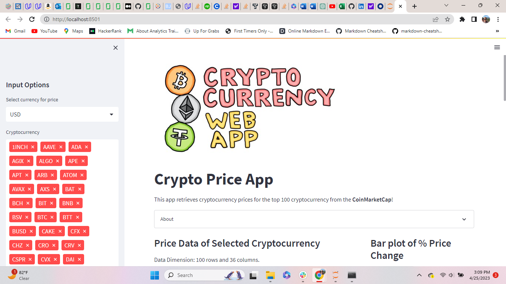
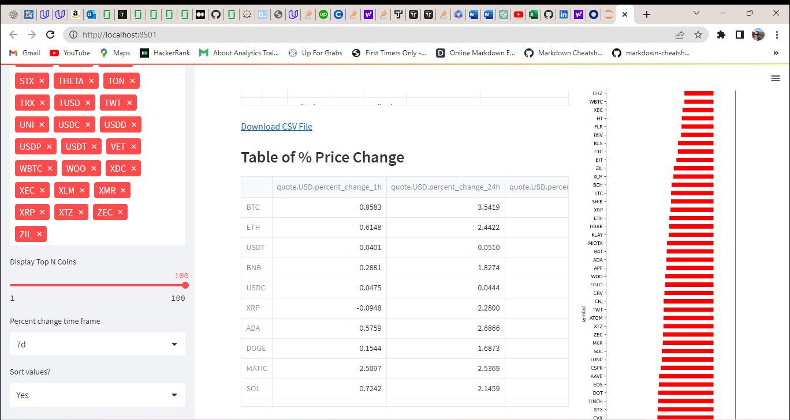

# Crypto Currency Web Application

## Description

This app retrieves cryptocurrency prices from CoinMarketCap.com for the top 100 coins.  The front end was built using Streamlit.  The original code used the Beautiful Soup python library to extract data from CoinMarketCap.  The code used a defined function called load data() to extract the data and build the list of columns which would later be displayed on the dashboard.  Due to site restrictions, scraping is no longer allowed so I modified the original code to connect to the Coinmarket Cap API to extract the data needed.    

## Dashboard Functionalities
- Hidden sidebar with a dropdown that lets the user select from 3 currencies to start with USD, BTC or ETH.
- The sidebar also has a slider widger which allows the user to choose the number of crypto coins to analyze. 1-100
- Above the widget the user also has the option to take out individual coins from the analysis by clicking on the coins ticker symbol
- The main page of the app diplays 2 tables and a dynamic bar chart with the specified number of coins
- The bar chart visually displays positive and negative % price changes in 1 hour, 24 hour and 1 week time frames
- The tables expand when you click on them to show all the coins listed and all of the different time frames

### Sneak Peak
                    

### Credits
The Data Proffessor/ Streamlit.io
